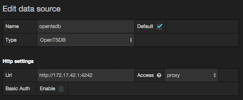

opentsdb-docker
===============

Files required to make a trusted opentsdb Docker such that opentsdb can be used for other project (e.g. scollector)

Notes
=====
 * This container has serf (www.serfdom.io) preinstalled.  It is expecting you to link the container to another container (such as ctlc/serf) with id "serf" (--link myserfcontainername:serf)
 * If you need to ssh to the container, make sure to pass your ssh key into the run command, e.g. docker run -tiP -e "SSH_KEY=$(cat /root/.ssh/id_dsa.pub)" petergrace/opentsdb
   
# Put metrics

To put metrics in there issue `while [ true ];do echo "put mymetric.test $(date +%s) ${RANDOM} host=foo"|nc -w1 localhost 4242;sleep 5;done` after accessing the opentsdb container. 
E.g. `docker exec -ti opentsdbdocker_opentsdb_1 bash`

# Grafana2 (user/passwd: admin/admin)
Grafana2 is a nice little dashboard that can consume a lot of different sources - OpenTSDB among them.

To use the grafana dashboard add a datasource "OpenTSDB" using the proxy mode. Grafana will query against the bridge loopback.

